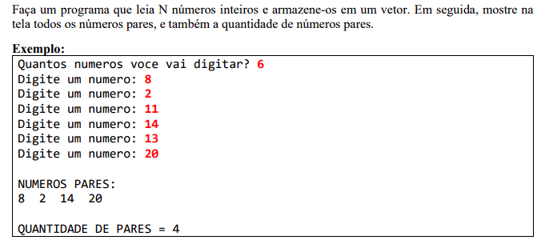
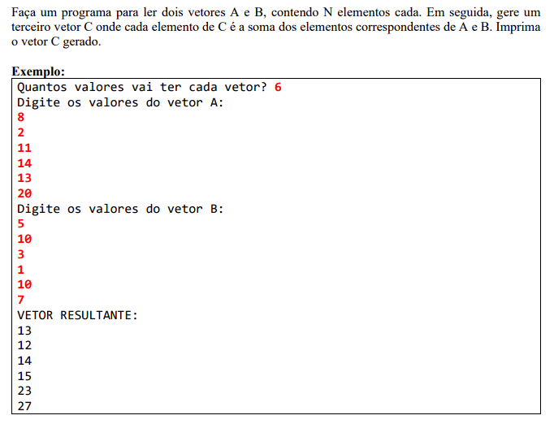
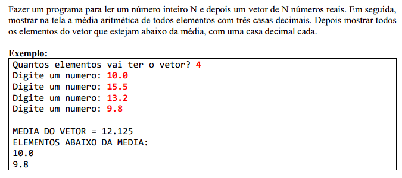
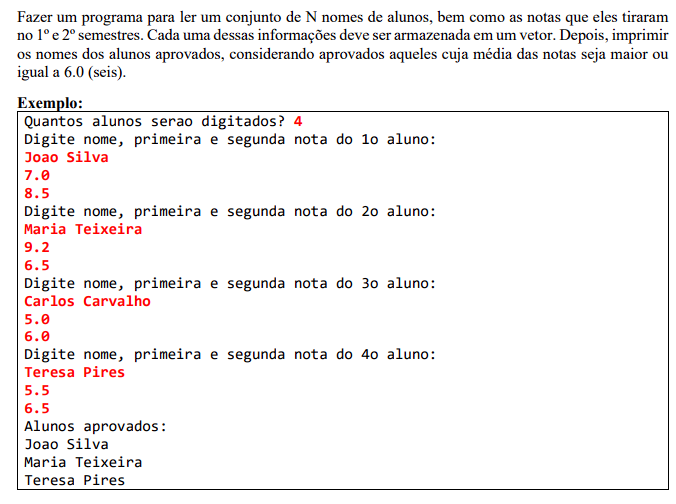
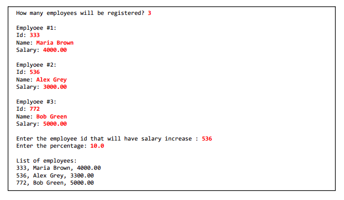

# Arrays e listas

#### Esta pasta contém uma lista de exercícios que visa a prática e o aprofundamento do conhecimento em arrays e listas. Cada exercício aborda uma situação específica, onde fui desafiado a utilizar esses conceitos para resolver problemas relacionados. 

Abaixo estão os exercícios propostos nesta lista, juntamente com links para as soluções correspondentes:

###  Exercício 01

### Solução 1: [Clique aqui](/Exercícios/Arrays%20e%20listas/src/exercicio01/application/Program.java)

###  Exercício 02

### Solução 2: [Clique aqui](/Exercícios/Arrays%20e%20listas/src/exercicio02/application/Program.java)

###  Exercício 03

### Solução 3: [Clique aqui](/Exercícios/Arrays%20e%20listas/src/exercicio03)

###  Exercício 04

### Solução 4: [Clique aqui](/Exercícios/Arrays%20e%20listas/src/exercicio04/application/Program.java)

###  Exercício 05

### Solução 5: [Clique aqui](/Exercícios/Arrays%20e%20listas/src/exercicio05/application/Program.java)

###  Exercício 06

### Solução 6: [Clique aqui](/Exercícios/Arrays%20e%20listas/src/exercicio06/application/Program.java)

###  Exercício 07

### Solução 7: [Clique aqui](/Exercícios/Arrays%20e%20listas/src/exercicio07/application/Program.java)

###  Exercício 08

### Solução 8: [Clique aqui](/Exercícios/Arrays%20e%20listas/src/exercicio08/application/Program.java)

###  Exercício 09

### Solução 9: [Clique aqui](/Exercícios/Arrays%20e%20listas/src/exercicio09)

###  Exercício 10

### Solução 10: [Clique aqui](/Exercícios/Arrays%20e%20listas/src/exercicio10)

###  Exercício 11

### Solução 11: [Clique aqui](/Exercícios/Arrays%20e%20listas/src/exercicio11)

###  Exercício 12

### Solução 12: [Clique aqui](/Exercícios/Arrays%20e%20listas/src/exercicio12)

###  Exercício 13

### Solução 13: [Clique aqui](/Exercícios/Arrays%20e%20listas/src/exercicio13)
