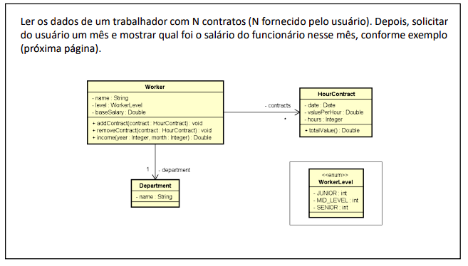
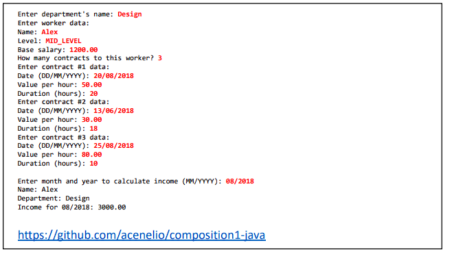
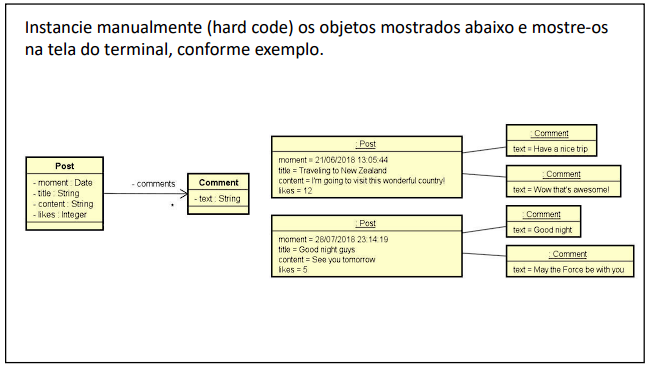
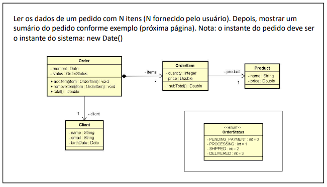

# 🧱 Composição de Classes e Enumeração

#### Esta seção explora a composição de classes e enumeração em Java. Resolvi exercícios práticos que demonstram como usar a composição para construir relacionamentos entre objetos e como aproveitar as enumerações para representar conjuntos fixos de valores.

Nessa lista, apronfudei meus conhecimentos sobre:
- Como criar e usar composição de classes para construir relacionamentos entre objetos.
- Como utilizar enumerações para representar conjuntos de valores fixos e restritos.
- Como as enumerações podem ser úteis para definir tipos personalizados e fornecer um conjunto predefinido de opções para escolha.
- A classe StringBuilder, que é uma poderosa ferramenta para manipulação eficiente de strings em Java.

Abaixo estão os exercícios propostos nesta lista, juntamente com links para as soluções correspondentes:

###  Exercício 01

### Solução 1: [Clique aqui](/Exercícios/Composição%20e%20Enumeração/src/exercicio01/)

###  Exercício 02

### Solução 2: [Clique aqui](/Exercícios/Composição%20e%20Enumeração/src/exercicio02/)

###  Exercício 03

### Solução 3: [Clique aqui](/Exercícios/Composição%20e%20Enumeração/src/exercicio03/)

