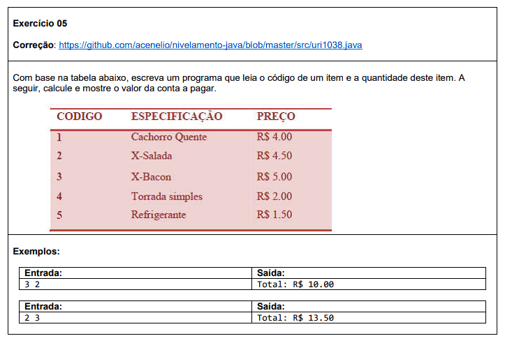
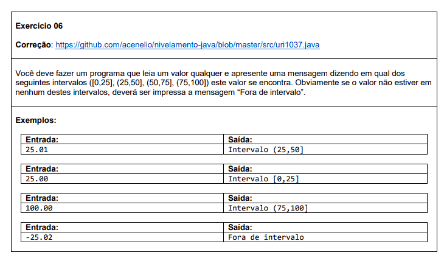
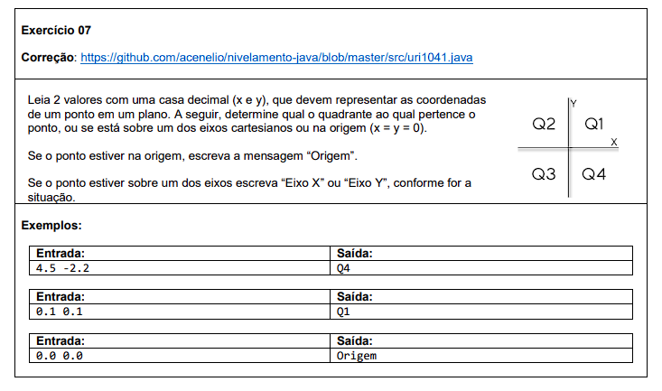

# Estrutura condicional

#### Esta pasta contém uma lista de exercícios que se concentram na prática da estrutura condicional em programação. Cada exercício aborda uma situação específica, e você será desafiado a escrever um programa que resolva o problema proposto usando instruções condicionais.

Abaixo estão os exercícios propostos nesta lista, juntamente com links para as soluções correspondentes:

###  Exercício 01

### Solução 1: [Clique aqui](/Exercícios/Estrutura%20condicional/src/exercicios01/Main.java)

###  Exercício 02

### Solução 2: [Clique aqui](Exercícios/Estrutura%20condicional/src/exercicios02/Main.java)

###  Exercício 03

### Solução 3: [Clique aqui](/Exercícios/Estrutura%20condicional/src/exercicios03/Main.java)

###  Exercício 04

### Solução 4: [Clique aqui](/Exercícios/Estrutura%20condicional/src/exercicios04/Main.java)

###  Exercício 05

### Solução 5: [Clique aqui](/Exercícios/Estrutura%20condicional/src/exercicios05/Main.java)

###  Exercício 06

### Solução 6: [Clique aqui](/Exercícios/Estrutura%20condicional/src/exercicios06/Main.java)

###  Exercício 07

### Solução 7: [Clique aqui](/Exercícios/Estrutura%20condicional/src/exercicios07/Main.java)

###  Exercício 08

### Solução 8: [Clique aqui](/Exercícios/Estrutura%20condicional/src/exercicios08/Main.java)
