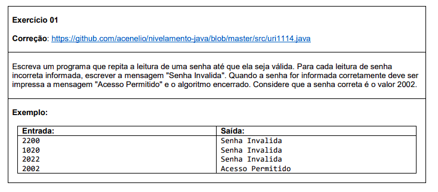
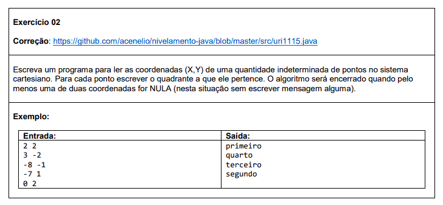
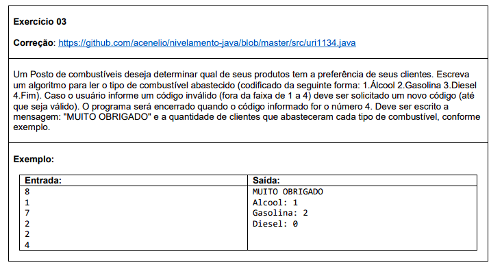

# Estrutura repetitiva

#### Nesta seção, você encontrará exercícios que envolvem a aplicação de estruturas de repetição, como for, while e do-while. Os problemas propostos permitem que você pratique a execução repetida de blocos de código com base em determinadas condições ou um número específico de iterações. Você trabalhará com loops para realizar cálculos, processar listas de dados, exibir padrões e muito mais.

Abaixo estão os exercícios propostos nesta lista, juntamente com links para as soluções correspondentes:

###  Exercício 01

### Solução 1: [Clique aqui](/Exercícios/Estrutura%20repetitiva/src/exercicio01/Program.java)

###  Exercício 02

### Solução 2: [Clique aqui](/Exercícios/Estrutura%20repetitiva/src/exercicio02/Program.java)

###  Exercício 03

### Solução 3: [Clique aqui](/Exercícios/Estrutura%20repetitiva/src/exercicio03/Program.java)
