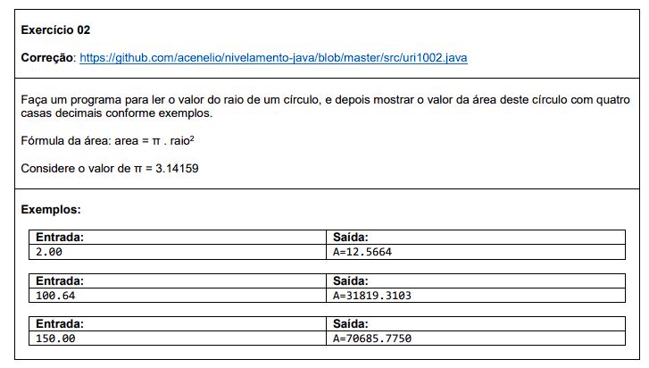
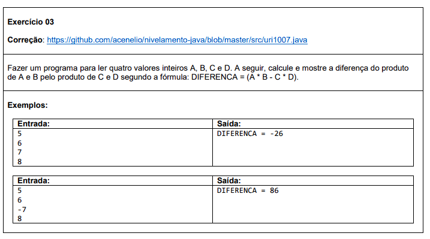

# Estrutura condicional

#### Nesta seção de exercícios, você encontrará problemas que envolvem a aplicação da estrutura sequencial em programação. Os exercícios abordam a resolução de tarefas que seguem uma sequência lógica de instruções, como cálculos matemáticos simples, conversões de unidades, manipulação de strings e entrada/saída de dados.

Abaixo estão os exercícios propostos nesta lista, juntamente com links para as soluções correspondentes:

###  Exercício 01

### Solução 1: [Clique aqui](/Exercícios/Estrutura%20sequencial/src/exercicio01/Program.java)

###  Exercício 02

### Solução 2: [Clique aqui](/Exercícios/Estrutura%20sequencial/src/exercicio02/Program.java)

###  Exercício 03

### Solução 3: [Clique aqui](/Exercícios/Estrutura%20sequencial/src/exercicio03/Program.java)

###  Exercício 04

### Solução 4: [Clique aqui](/Exercícios/Estrutura%20sequencial/src/exercicio04/Program.java)

###  Exercício 05

### Solução 5: [Clique aqui](/Exercícios/Estrutura%20sequencial/src/exercicio05/Program.java)

###  Exercício 06

### Solução 6: [Clique aqui](/Exercícios/Estrutura%20sequencial/src/exercicio06/Program.java)
