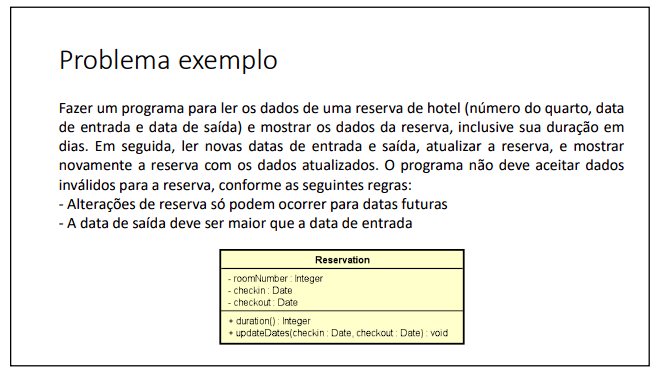
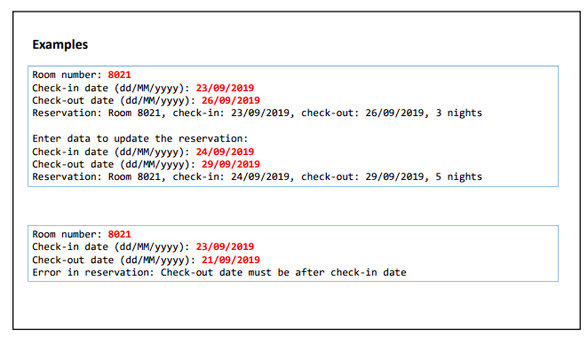
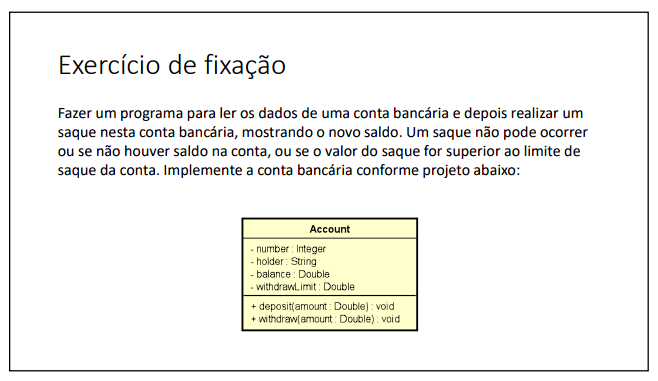
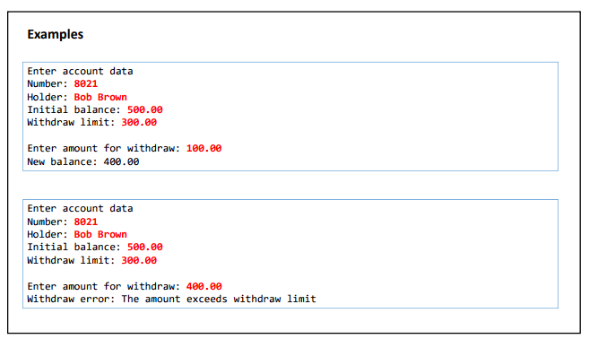
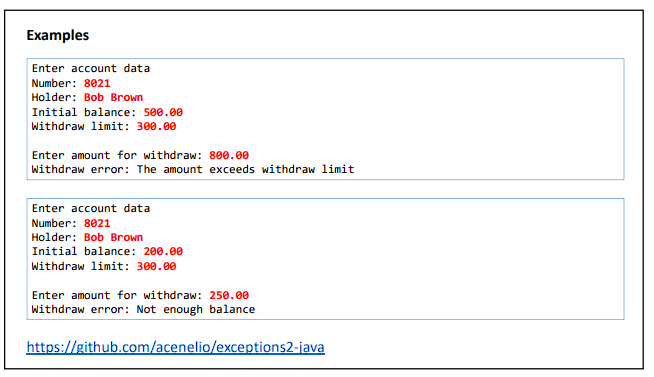

# ⚠️ Exceptions 

#### Esta pasta contém uma lista de exercícios que se concentram na prática e no aprofundamento do conhecimento em exceções em Java. Esses exercícios proporcionaram uma oportunidade de aprimorar minhas habilidades de resolução de problemas e fortalecer minha compreensão sobre o tratamento de exceções em Java. Cada exercício aborda uma situação específica em que fui desafiado a lidar com exceções para resolver problemas relacionados.

Durante a resolução desses exercícios, pude desenvolver habilidades importantes relacionadas a exceções, incluindo:
- Compreensão dos conceitos de exceções em Java e sua importância no tratamento de erros.
- Utilização de blocos try-catch para capturar e lidar com exceções lançadas durante a execução do programa.
- Implementação de blocos finally para garantir a execução de código mesmo após a ocorrência de exceções.
- Exploração dos diferentes tipos de exceções disponíveis em Java e sua aplicação adequada em diferentes cenários.
- Utilização de declarações throws para propagar exceções e fornecer informações adicionais sobre possíveis erros.

Abaixo estão os exercícios propostos nesta lista, juntamente com links para as soluções correspondentes:

###  Exercício 01

### Solução 1: [Clique aqui](/Exercícios/Exceptions/src/exercicio01/)

###  Exercício 02

### Solução 2: [Clique aqui](/Exercícios/Exceptions/src/exercicio02/)

