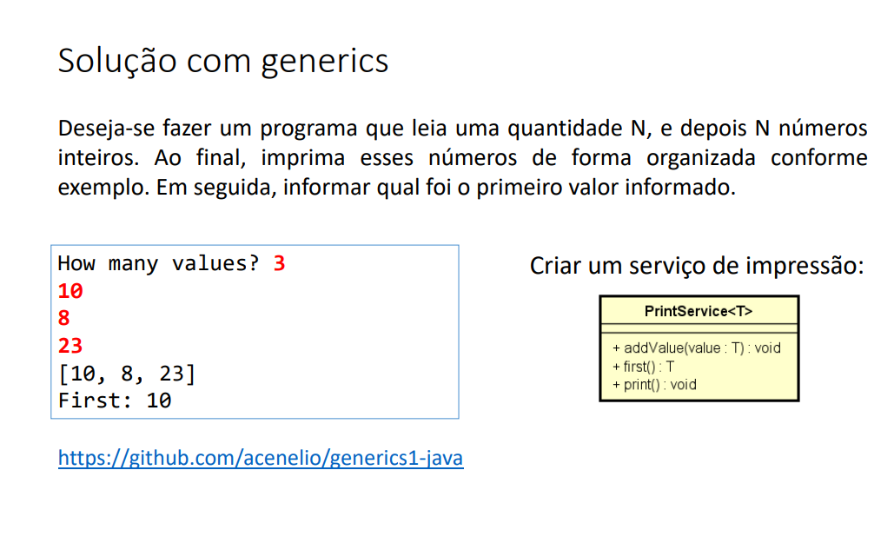
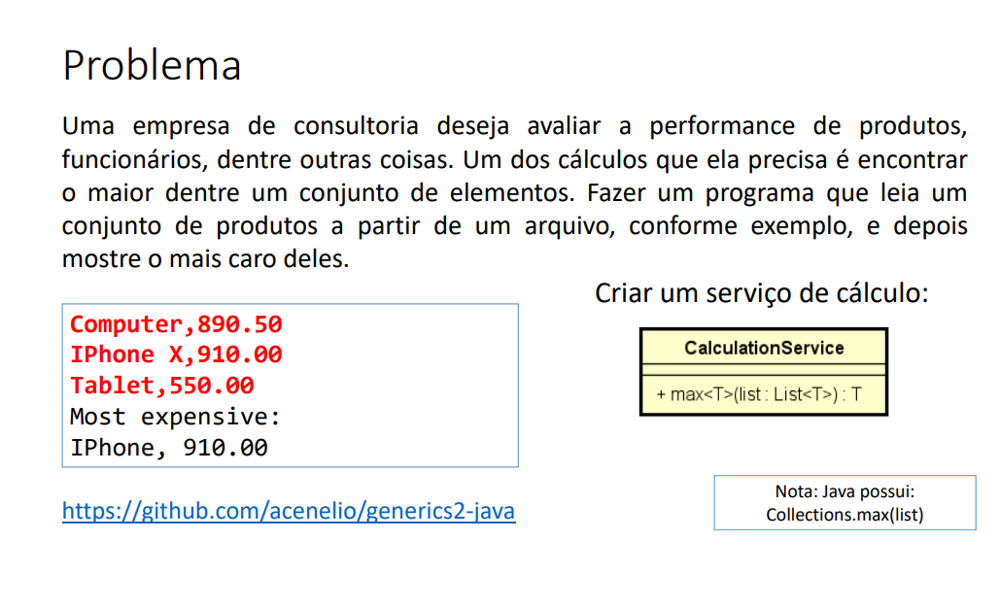
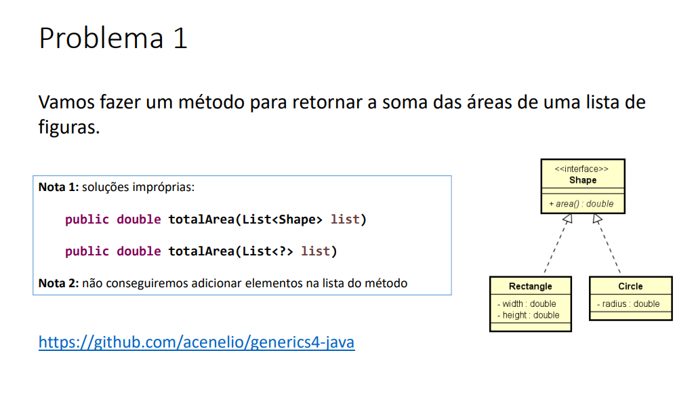
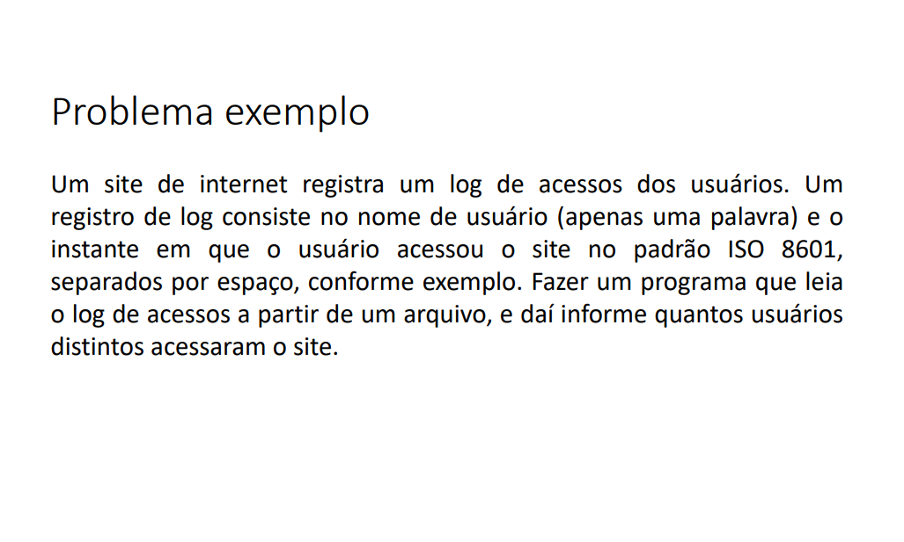
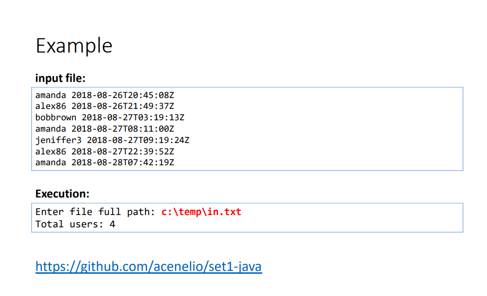
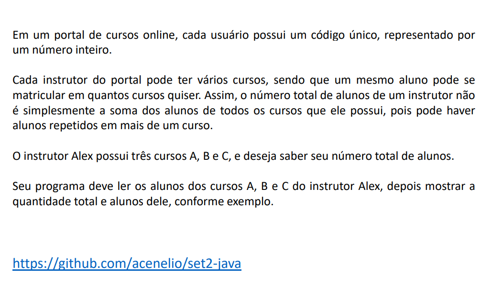
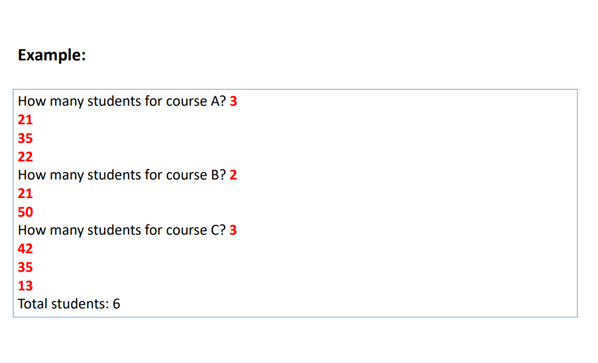
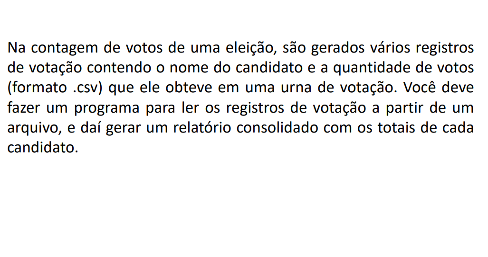
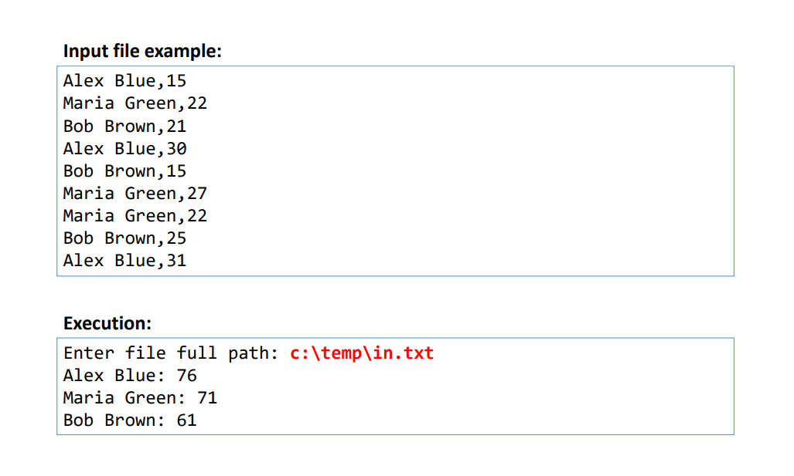

# 🗺️ Generics, Set e Map

#### Esta seção contém uma série de exemplos e práticas que abordam o uso de Generics, Set e Map em Java. Durante o desenvolvimento desses exemplos, pude explorar e aprofundar meu conhecimento sobre o uso eficaz desses recursos fundamentais da linguagem.

Durante a resolução desses exercícios, desenvolvi habilidades importantes, incluindo:
- Compreensão do conceito de Generics e sua aplicação na criação de classes e métodos parametrizados que permitem o uso de tipos genéricos de dados.
- Exploração do uso de Set para armazenar coleções de elementos únicos, compreendendo a diferença entre HashSet, TreeSet e LinkedHashSet, e aprendendo a manipular conjuntos de dados de forma eficiente.
- Utilização de Map para armazenar pares de chave-valor, compreendendo a diferença entre HashMap, TreeMap e LinkedHashMap, e aprendendo a manipular esses pares de dados de forma eficaz.
- Implementação de práticas seguras e eficientes ao lidar com Generics, Set e Map, garantindo a robustez e a segurança das operações ao longo do desenvolvimento.

Abaixo estão os exercícios propostos nesta lista, juntamente com links para as soluções correspondentes:

###  Exercício 01

### Solução 1: [Clique aqui](/Exercícios/Generics,%20Set%20e%20Map/src/exercicio01/)

###  Exercício 02

### Solução 2: [Clique aqui](/Exercícios/Generics,%20Set%20e%20Map/src/exercicio02/)

###  Exercício 03

### Solução 3: [Clique aqui](/Exercícios/Generics,%20Set%20e%20Map/src/exercicio03/)

###  Exercício 04

### Solução 4: [Clique aqui](/Exercícios/Generics,%20Set%20e%20Map/src/exercicio04/)

###  Exercício 05

### Solução 5: [Clique aqui](/Exercícios/Generics,%20Set%20e%20Map/src/exercicio05/)

###  Exercício 06

### Solução 6: [Clique aqui](/Exercícios/Generics,%20Set%20e%20Map/src/exercicio06/)