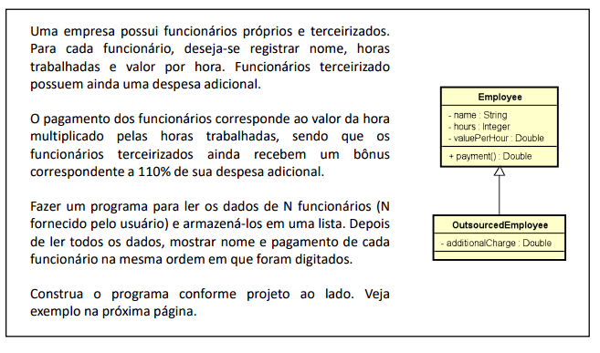
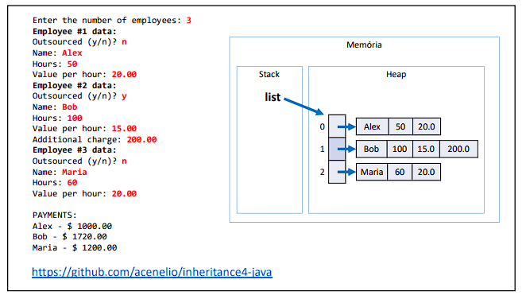
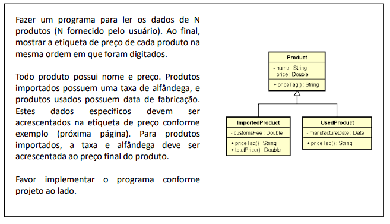
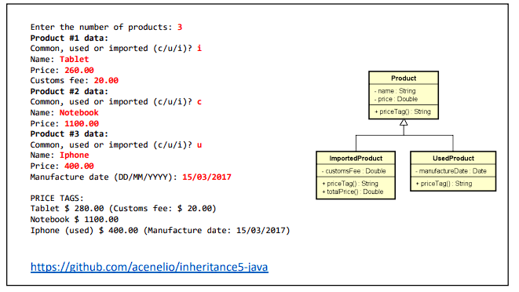
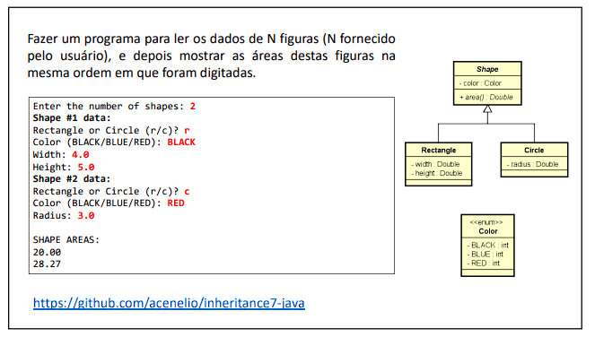
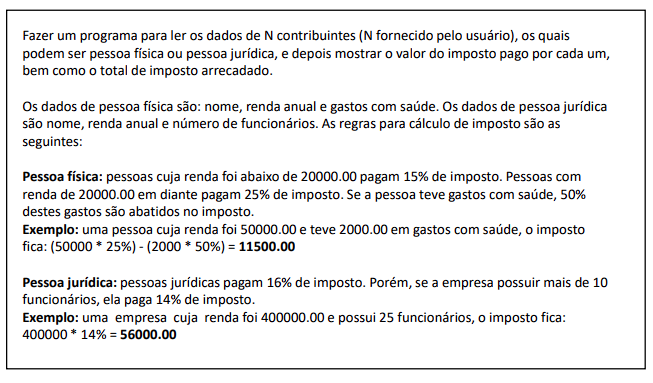
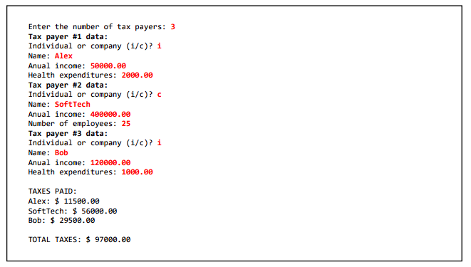

# 🧬 Herança e Polimorfismo

#### Esta seção abrange exercícios práticos que visam aprofundar o conhecimento em herança e polimorfismo, dois conceitos fundamentais da Programação Orientada a Objetos (POO). Além disso, essa lista aborda conceitos sobre Upcasting, Downcasting, Sobreposição, Classes abstratas e Métodos abstratos.

Durante a resolução dos exercícios, pude explorar as seguintes habilidades e conceitos:
- Entendimento da relação de herança entre classes, permitindo a criação de hierarquias de classes com características comuns.
- Utilização de herança para compartilhar atributos e métodos entre classes relacionadas.
- Aplicação de polimorfismo para criar métodos e comportamentos que podem ser implementados de maneiras diferentes em classes derivadas.
- Exploração dos benefícios do polimorfismo para criar código mais flexível, reutilizável e extensível.
- Uso de Upcasting para converter um objeto de uma classe derivada para sua classe base, permitindo tratá-lo de forma genérica.
- Utilização de Downcasting para converter um objeto de uma classe base para sua classe derivada, permitindo acessar métodos e atributos específicos da classe derivada.
- Sobreposição de métodos, onde uma classe derivada implementa um método com a mesma assinatura da classe base, permitindo alterar seu comportamento.
- Criação de classes abstratas, que servem como base para outras classes, mas não podem ser instanciadas por si só.
- Definição de métodos abstratos em classes abstratas, que são declarados sem implementação e devem ser implementados pelas classes derivadas.
- Solução de problemas práticos que envolveram o uso de herança e polimorfismo para modelar e resolver desafios específicos.

Abaixo estão os exercícios propostos nesta lista, juntamente com links para as soluções correspondentes:

###  Exercício 01

### Solução 1: [Clique aqui](/Exercícios/Herança%20e%20polimorfismo/src/exercicio01)

###  Exercício 02

### Solução 2: [Clique aqui](/Exercícios/Herança%20e%20polimorfismo/src/exercicio02)

###  Exercício 03

### Solução 3: [Clique aqui](/Exercícios/Herança%20e%20polimorfismo/src/exercicio03)

###  Exercício 04

### Solução 4: [Clique aqui](/Exercícios/Herança%20e%20polimorfismo/src/exercicio04)

