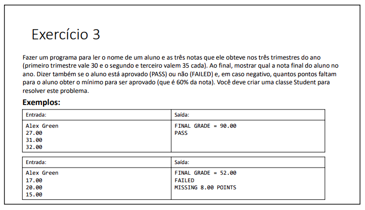
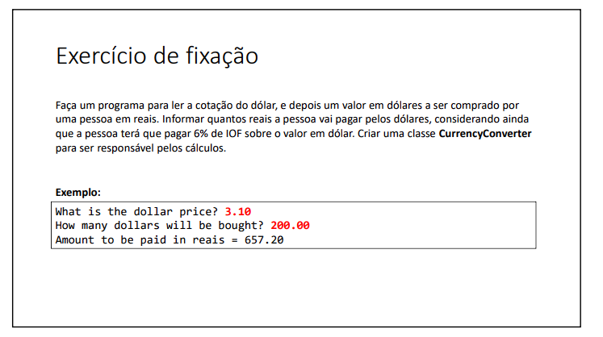
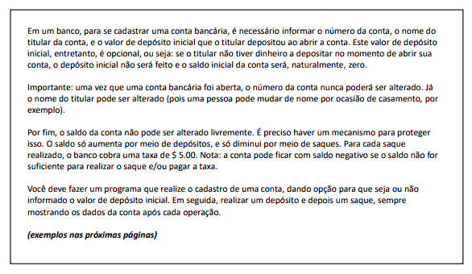

# Iniciando POO

#### Nesta lista de exercícios, resolvi uma variedade de problemas utilizando os princípios da POO. A POO é uma abordagem de programação que organiza o código em torno de objetos, que representam entidades do mundo real e possuem propriedades (atributos) e comportamentos (métodos).

Abaixo estão os exercícios propostos nesta lista, juntamente com links para as soluções correspondentes:

###  Exercício 01

### Solução 1: [Clique aqui](/Exercícios/Iniciando%20POO/exercicio1/src)

###  Exercício 02

### Solução 2: [Clique aqui](/Exercícios/Iniciando%20POO/exercicio2/src)

###  Exercício 03

### Solução 3: [Clique aqui](/Exercícios/Iniciando%20POO/exercicio3/src)

###  Exercício 04

### Solução 4: [Clique aqui](/Exercícios/Iniciando%20POO/exercicio4/src)

###  Exercício 05

### Solução 5: [Clique aqui](/Exercícios/Iniciando%20POO/exercicio5/src)
