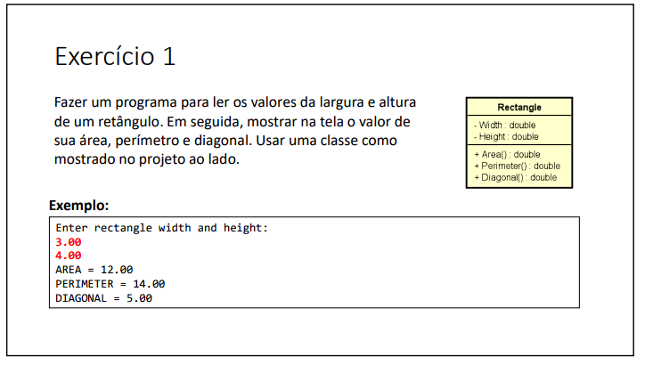
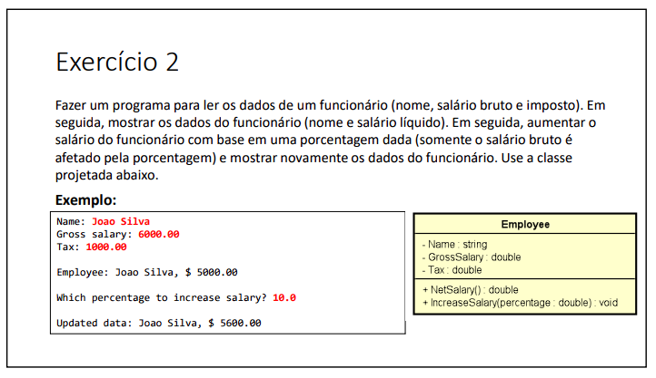

# Iniciando POO

#### Nesta lista de exercícios, resolvi uma variedade de problemas utilizando os princípios da POO. A POO é uma abordagem de programação que organiza o código em torno de objetos, que representam entidades do mundo real e possuem propriedades (atributos) e comportamentos (métodos).

Durante a resolução desses exercícios, adquiri conhecimentos importantes, incluindo:
- Criação de classes, que servem como modelos para criar objetos.
- Definição de atributos para representar as propriedades dos objetos.
- Implementação de métodos para descrever os comportamentos dos objetos.
- Utilização de encapsulamento para controlar o acesso aos atributos e métodos de uma classe.
- Instanciação de objetos, criando instâncias únicas baseadas em uma classe.

Abaixo estão os exercícios propostos nesta lista, juntamente com links para as soluções correspondentes:

###  Exercício 01

### Solução 1: [Clique aqui](/Exercícios/Iniciando%20POO/exercicio01)

###  Exercício 02

### Solução 2: [Clique aqui](/Exercícios/Iniciando%20POO/exercicio02)

###  Exercício 03

### Solução 3: [Clique aqui](/Exercícios/Iniciando%20POO/exercicio03)

###  Exercício 04

### Solução 4: [Clique aqui](/Exercícios/Iniciando%20POO/exercicio04)

###  Exercício 05

### Solução 5: [Clique aqui](/Exercícios/Iniciando%20POO/exercicio05)
