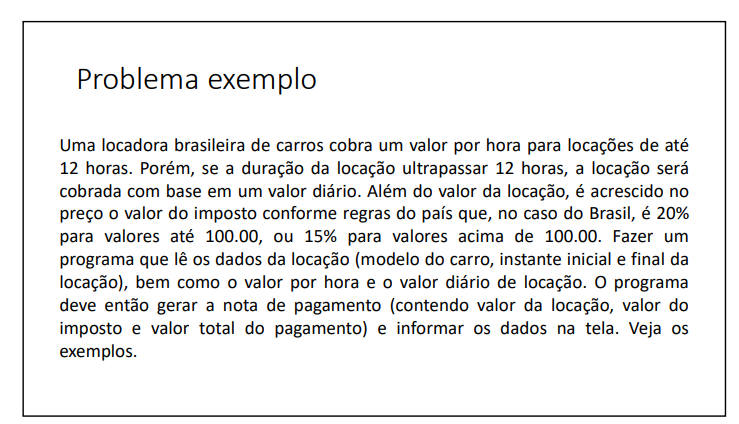
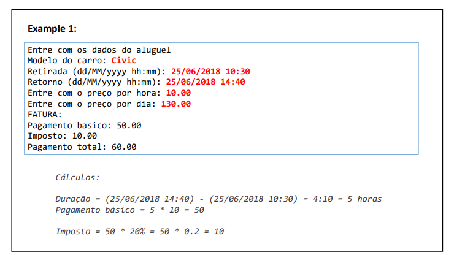
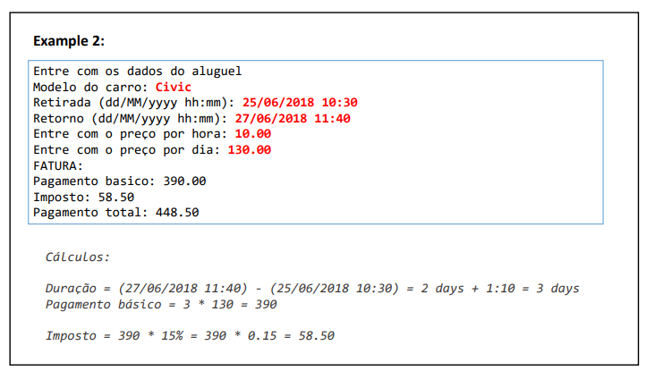
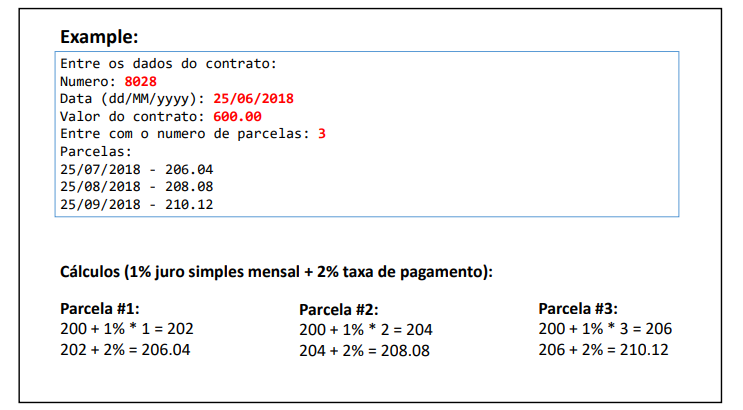
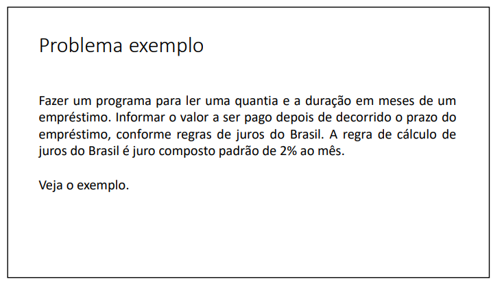
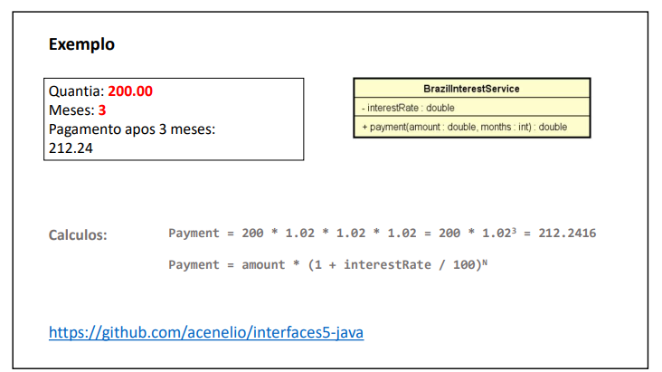

# 🌐 Interfaces

#### Esta pasta contém uma lista de exercícios que visa a prática e o aprofundamento do conhecimento em interfaces em Java. Cada exercício aborda a implementação e o uso de interfaces para resolver problemas relacionados.

Durante a resolução desses exercícios, desenvolvi habilidades importantes, incluindo:
- Implementação de interfaces em diferentes classes para garantir a interoperabilidade entre objetos.
- Utilização de polimorfismo para criar implementações específicas de interfaces que atendam a diferentes requisitos.
- Exploração do uso de métodos padrão e métodos estáticos em interfaces para fornecer comportamentos comuns para classes implementadoras.
- Aplicação de herança e abstração para garantir a implementação consistente de funcionalidades entre as classes.

Abaixo estão os exercícios propostos nesta lista, juntamente com links para as soluções correspondentes:

###  Exercício 01

### Solução 1: [Clique aqui](/Exercícios/Interfaces/src/exercicio01/application/)

###  Exercício 02

### Solução 2: [Clique aqui](/Exercícios/Interfaces/src/exercicio02/application/)

###  Exercício 03

### Solução 3: [Clique aqui](/Exercícios/Interfaces/src/exercicio03/application/)