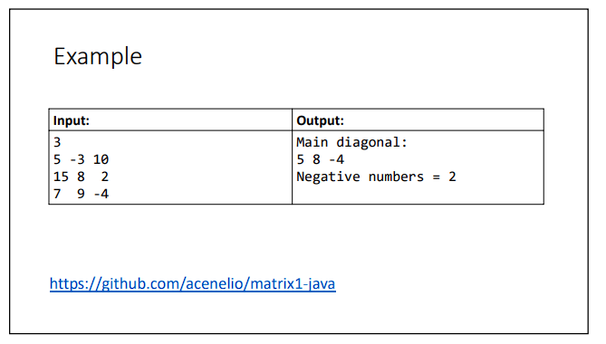

# Estrutura condicional

#### Esta pasta contém uma lista de exercícios que visa a prática e o aprofundamento do conhecimento em matrizes. Cada exercício aborda uma situação específica, onde fui desafiado a utilizar matrizes para resolver problemas relacionados.

Abaixo estão os exercícios propostos nesta lista, juntamente com links para as soluções correspondentes:

###  Exercício 01

### Solução 1: [Clique aqui](/Exercícios/Matriz/src/matriz/application/Program.java)

###  Exercício 02

### Solução 2: [Clique aqui](/Exercícios/Matriz/src/matriz2/application/Program.java)

