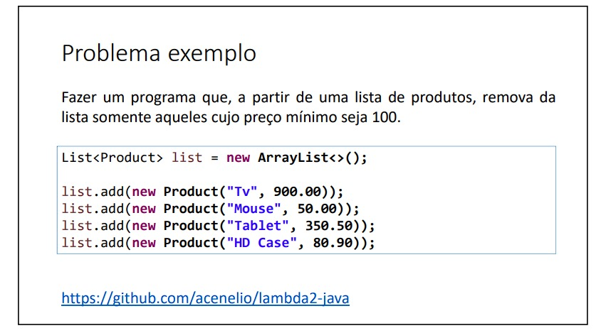
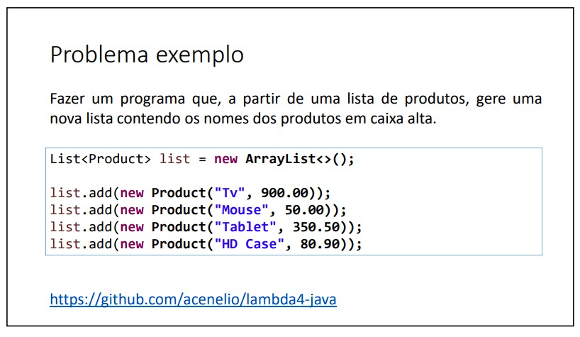
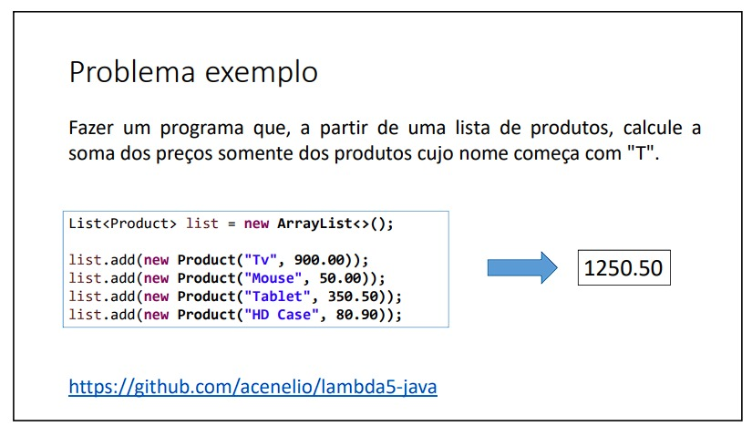
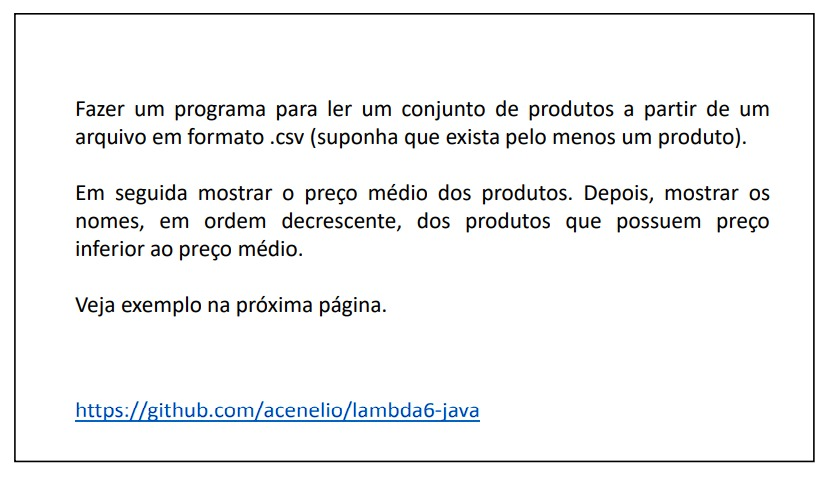
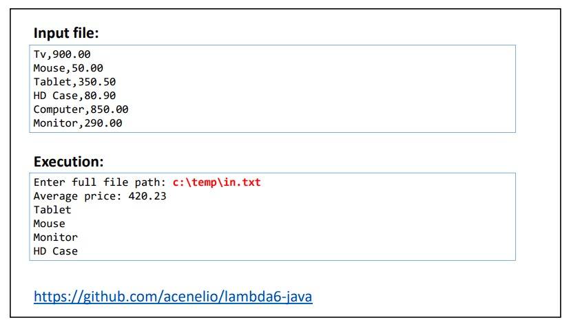
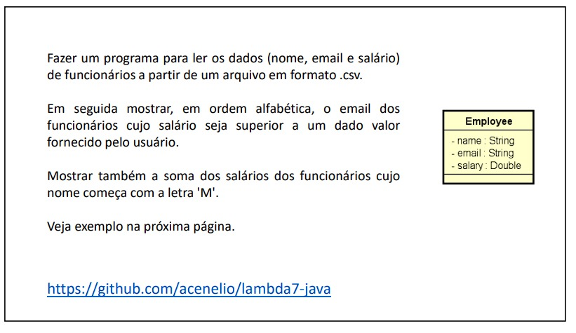
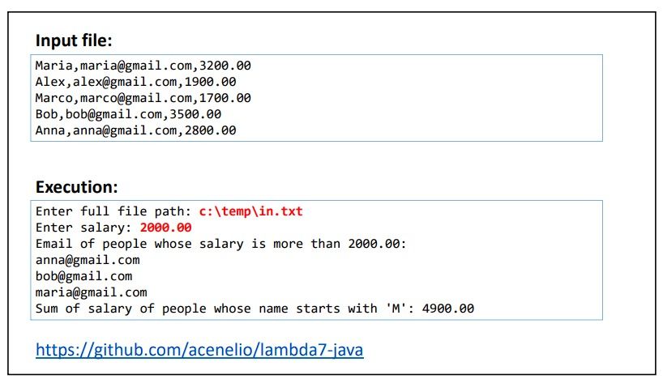

# 🚀 Programação funcional e expressões lambda

#### Nesta lista de exercícios, explorei conceitos de programação funcional e expressões lambda em Java. Cada exercício visa praticar e aprofundar o conhecimento nesse paradigma de programação, abordando situações específicas.

Durante a resolução desses exercícios, desenvolvi habilidades importantes, incluindo:
- Compreensão dos princípios da programação funcional.
- Utilização de funções lambda para passagem de comportamentos como parâmetros.
- Aplicação de funções de ordem superior, como map, filter e reduce.
- Manipulação de coleções usando expressões lambda para realizar operações como filtragem, mapeamento e redução.

Abaixo estão os exercícios propostos nesta lista, juntamente com links para as soluções correspondentes:

###  Exercício 01

### Solução 1: [Clique aqui](/Exercícios/Programação%20funcional%20e%20expressões%20lambda/src/exercicio01/)

###  Exercício 02

### Solução 2: [Clique aqui](/Exercícios/Programação%20funcional%20e%20expressões%20lambda/src/exercicio02/)

###  Exercício 03

### Solução 3: [Clique aqui](/Exercícios/Programação%20funcional%20e%20expressões%20lambda/src/exercicio03/)

###  Exercício 04

### Solução 4: [Clique aqui](/Exercícios/Programação%20funcional%20e%20expressões%20lambda/src/exercicio04/)

###  Exercício 05

### Solução 5: [Clique aqui](/Exercícios/Programação%20funcional%20e%20expressões%20lambda/src/exercicio05/)

###  Exercício 06

### Solução 6: [Clique aqui](/Exercícios/Programação%20funcional%20e%20expressões%20lambda/src/exercicio06/)

